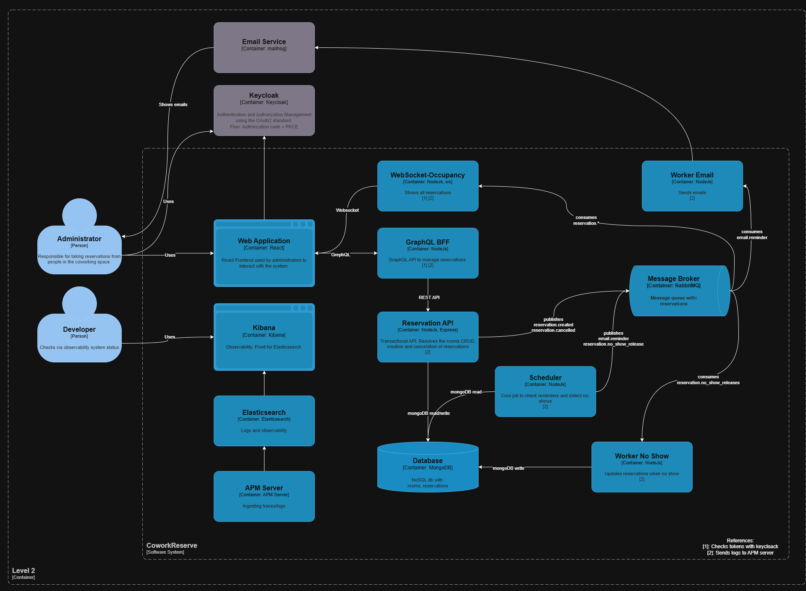
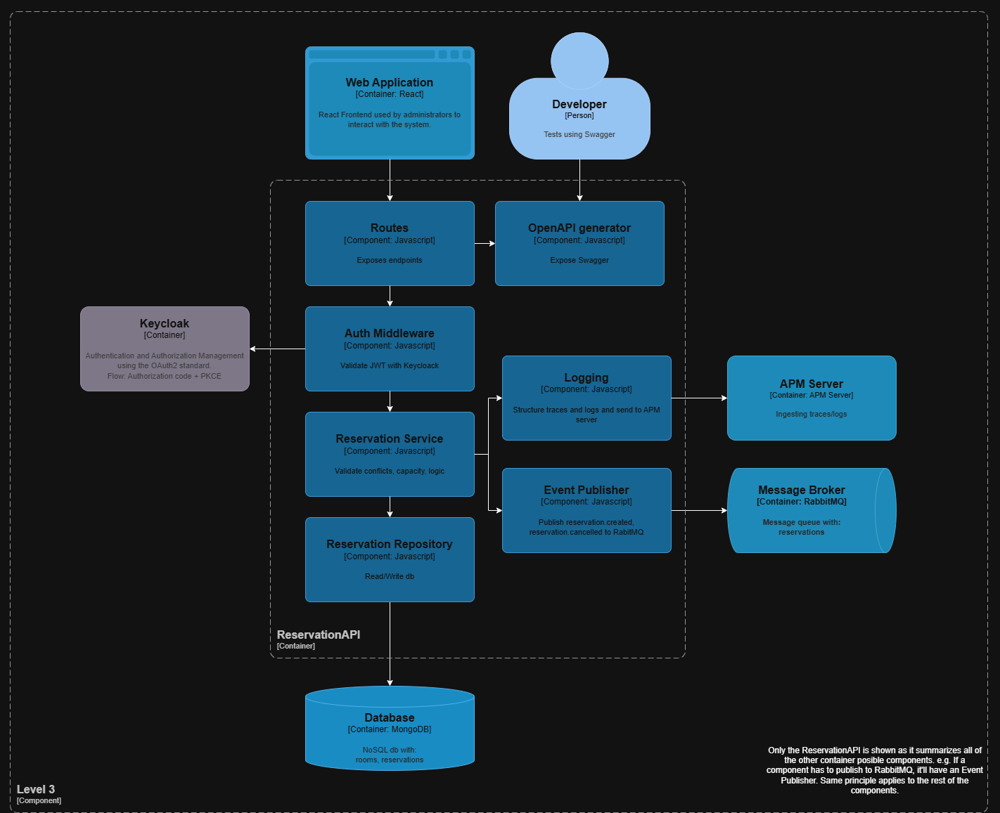

# IAW-TPI-README.md

# **About**

Este es el Trabajo Práctico Integrador de la materia Integración de Aplicaciones en Entornos Web de la Universidad Tecnológica Nacional Facultad Regional Córdoba

*Integrantes:*

- BORDINO CONIGLIO, Tobias Martin - 93611
- CEBALLOS COLOMBO, Mateo - 90419
- MORENO, Tomas Agustin - 90365
- SUAREZ, Emiliano Fabricio - 91134

*Dominio elegido:* 5. Reserva de Salas en Co-working

*Link al enunciado:* https://docs.google.com/document/d/19nT2gK9bMSRasNAo5_cV-8qHkDXTDJVwe21OexxzCzc/edit?tab=t.0#heading=h.x0aijsgcfew2

---

# **Etapa 1**

## **Diagramas C4**

**Diagrama de Contexto (Nivel 1)**


- **Actor:**
    - **Administrador:** Persona que gestiona las reservas en el espacio de coworking.
        
        Interactúa directamente con *CoworkReserve* y se autentica mediante *Keycloak*.
        
- **Sistemas internos:**
    - **CoworkReserve:** Sistema principal que permite gestionar reservas (crear, cancelar, ver disponibilidad).
- **Sistemas externos:**
    - **Keycloak:** Servicio de autenticación y autorización externo (gestiona inicios de sesión y permisos).
    - **Email Service:** Servicio externo para enviar correos (confirmaciones, recordatorios, etc.).

El **Administrador** se autentica en *Keycloak* para acceder al sistema y usa *CoworkReserve* para manejar reservas. Por su parte, *CoworkReserve* usa el *Email Service* para enviar correos (vía SMTP) al **Administrador**.

**Diagrama de Contenedores (Nivel 2)**



- **Usuarios:**
    - **Administrador:** Usa la aplicación web para realizar reservas.
    - **Desarrollador:** Supervisa logs y métricas (Kibana).
- **Contenedores internos (azules):**
    - **Web Application (React):** Interfaz de usuario principal.
    - **GraphQL BFF:** API intermedia que sirve datos al frontend.
    - **Reservation API (Node.js/Express):** Backend transaccional que gestiona la lógica de reservas.
    - **Scheduler:** Crea y ejecuta trabajos programados (por ejemplo, verificar reservas expiradas).
    - **Database (MongoDB):** Almacena información de reservas y usuarios.
    - **Message Broker (RabbitMQ):** Cola de mensajes para eventos del sistema.
    - **Worker Email:** Servicio asíncrono que envía correos.
    - **Worker No Show:** Actualiza reservas cuando el usuario no se presenta.
    - **APM Server + Elasticsearch + Kibana:** Sistema de observabilidad (logs y métricas).
- **Sistemas externos (grises):**
    - **Keycloak:** Autenticación/autorización.
    - **Email Service (mailhog):** Envío de correos.

El Administrador interactúa con la aplicación web, la cual se comunica con el *GraphQL BFF*. Este *BFF* realiza llamadas a la *Reservation API*, implementada con REST, que a su vez se encarga de leer y escribir en la base de datos y de publicar eventos en *RabbitMQ*. Los Workers consumen dichos eventos para ejecutar tareas como el envío de correos y la gestión de casos de “no show”. Además, el componente Scheduler se encarga de ejecutar tareas programadas y generar nuevos eventos. La autenticación de usuarios se gestiona mediante *Keycloak*, mientras que *Mailhog* se encarga del manejo y envío de correos electrónicos. Finalmente, los registros y trazas del sistema se recopilan en *APM Server* y se visualizan a través de *Kibana*.

**Diagrama de Componentes (Nivel 3)**



**Componentes:**

- **Routes:** Expone los endpoints HTTP.
- **Auth Middleware:** Valida JWT con *Keycloak* (OAuth2 + PKCE).
- **Reservation Service:** Contiene la lógica principal (validaciones, capacidad, conflictos).
- **Reservation Repository:** Interactúa con la base de datos MongoDB.
- **Event Publisher:** Publica eventos (“reservation_created”, “reservation_cancelled”) a RabbitMQ.
- **Logging:** Estructura logs y los envía al APM Server.
- **OpenAPI Generator:** Expone documentación Swagger para pruebas.

**Dependencias externas:**

- **Keycloak:** Autenticación.
- **Database (MongoDB):** Persistencia.
- **Message Broker (RabbitMQ):** Comunicación asíncrona.
- **APM Server:** Recolección de logs/trazas.

## **ADRs (Arquitecture Decision Record)**

### 1. Estructura del Proyecto y Stack Tecnológico

- **Decisión: Monorepo con Docker Compose y Makefile.**
    - **Justificación:** Se utiliza un único repositorio de Git + GitHub para todo el código. Esto simplifica la gestión, permite compartir código fácilmente entre servicios y asegura que todo el entorno se pueda levantar con un solo comando (`docker compose up`), haciendo el proyecto fácil de reproducir y entregar.
- **Decisión: Stack tecnológico homogéneo con JavaScript.**
    - **Justificación:** Se usa **Node.js** para todo el backend (API, workers) y **React** para el frontend. Esto unifica el lenguaje en todo el proyecto, facilitando el desarrollo y la reutilización de código y lógica.

### 2. Arquitectura de Servicios

- **Decisión: API REST para el dominio, un BFF GraphQL para el frontend y un servicio de WebSocket separado.**
    - **Justificación:** Se cumple el requisito obligatorio de una **API REST con OpenAPI 3.1** para la lógica de negocio principal. Se añade un **GraphQL BFF (Backend-for-Frontend)** para que el cliente React pueda pedir solo los datos que necesita, cumpliendo un requisito opcional sin complicar la API principal. El servicio de **WebSocket-Occupancy** **se aísla** en su propio contenedor (Socket.IO/ws) para manejar las notificaciones en tiempo real de forma eficiente y escalable.

### 3. Seguridad

- **Decisión: Keycloak en Docker para gestionar la autenticación y autorización (OAuth2 + PKCE).**
    - **Justificación:** Se delega la seguridad a una herramienta estándar y robusta. Usar **Keycloak** nos ahorra el tiempo y el riesgo de construir un sistema de login propio. El flujo **Authorization Code + PKCE** es el más seguro para aplicaciones web de tipo SPA (Single-Page Application) como React. Los endpoints están protegidos para que solo el rol `admin` pueda acceder.
- **Decisión: La validación de tokens JWT se realiza solo en la frontera.**
    - **Justificación:** Únicamente los servicios que reciben tráfico externo (la API REST, el BFF y el WebSocket) verifican los tokens. Los servicios internos como los workers son considerados "de confianza" y no necesitan validar tokens, simplificando la comunicación interna.

### 4. Asincronía y Datos

- **Decisión: RabbitMQ como broker, un Scheduler para tareas programadas y MongoDB como base de datos.**
    - **Justificación:** **RabbitMQ** se usa para desacoplar los servicios. Cuando se crea una reserva, la API publica un evento y responde de inmediato, mientras que los **workers** (`worker-email`, `worker-no-show`) procesan las tareas (enviar recordatorios, liberar salas) en segundo plano. Un **Scheduler** simple revisa la base de datos periódicamente (cada 1 minuto) para encolar estas tareas, contando con un endpoint *admin* para forzar ejecución.
    Se eligió **MongoDB** por su flexibilidad y su alineación natural con el ecosistema de JavaScript.
    - Colas/topics mínimos: email.reminder, reservation.no_show_release, reservation.created, reservation.cancelled.

### 5. Observabilidad

- **Decisión: Implementar el Stack de Elastic (Elasticsearch, Kibana, APM Server) en Docker.**
    - **Justificación:** Todos los servicios generan **logs estructurados en JSON** y **trazas con APM**. Esto nos permite centralizar toda la información en Kibana para crear dashboards (latencia p95, tasa de errores) y analizar problemas fácilmente, cumpliendo con todos los requisitos de observabilidad en un único stack.

### 6. Entorno de Desarrollo y Pruebas

- **Decisión: Usar Mailhog para emails locales, scripts de "seed" para datos iniciales y una colección de Postman.**
    - **Justificación:** **Mailhog** nos permite ver los correos enviados por el sistema sin necesidad de configurar un servicio de email real (SMTP dev + UI en [http://localhost:8025](http://localhost:8025/)) y el worker enviará mails a mailhog:1025.
    Los **scripts de "seed"** cargan datos de prueba (salas, usuarios) para que la aplicación sea funcional desde el primer momento. La colección de **Postman** asegura que las pruebas de la API sean consistentes y reproducibles.

### 7. Simplificaciones y Alcance (Qué decidimos NO hacer)

- **Decisión: No implementar reintentos, caché ni auditoría de emails.**
    - **Justificación:** Para mantener la complejidad del proyecto bajo control y enfocarnos en cumplir los requisitos principales, se decidió que el worker de email **intentará enviar cada correo una sola vez**. Si falla, solo se registrará en los logs. Tampoco se implementarán sistemas de caché o batching. Estas son mejoras que se podrían añadir en el futuro.

## Modelo de Datos

### Schema GraphQL

```yaml
# schema.graphql

type Query {
  reservations(date: String): [Reservation!]!
  reservation(id: ID!): Reservation
  rooms: [Room!]!
}

type Mutation {
  createReservation(input: ReservationInput!): Reservation!
  cancelReservation(id: ID!): Reservation!
}

type Reservation {
  id: ID!
  roomId: ID!
  title: String!
  requesterEmail: String!
  startsAt: Date!
  endsAt: Date!
  status: ReservationStatus!
  createdAt: Date!
}

input ReservationInput {
  roomId: ID!
  requesterEmail: String!
  title: String
  startsAt: Date
  endsAt: Date
}

type Room {
  id: ID!
  name: String!
  description: String
  capacity: Int!
  location: String
  createdAt: Date!
}

enum ReservationStatus {
  CONFIRMED
  CANCELLED
}
```

### Ejemplos Request - Response

**Obtener Reservas**

```graphql
query {
  reservations(date: "2025-11-13") {
    id
    roomId
    title
    status
  }
}
```

```json
{
  "data": {
    "reservations": [
      { "id": "res_123", "roomId": "room_42", "title": "Reunión", "status": "CONFIRMED" }
    ]
  }
}
```

**Crear Reserva**

```graphql
mutation {
  createReservation(input: {
    roomId: "room_42",
    requesterEmail: "admin@coworking.com",
    title: "Reunión Operativa",
    startsAt: "2025-11-13T14:00:00Z",
    endsAt: "2025-11-13T15:00:00Z"
  }) {
    id
    status
  }
}
```

```json
{
  "data": {
    "createReservation": {
      "id": "res_123",
      "status": "CONFIRMED"
    }
  }
}
```


### Esquema Mongo DB

#### room
```json
{
  "_id": { "$oid": "654000000000000000000001" },
  "name": "Sala Principal",
  "description": "Sala con proyector y pizarra",
  "capacity": 8,
  "location": "Piso 3 - Ala A"
}
```

#### reservation
```json
{
  "_id": { "$oid": "655000000000000000000001" },
  "roomId": { "$oid": "654000000000000000000001" },
  "title": "Reunión semanal",
  "requesterEmail": "juan.perez@example.com",
  "startsAt": "2025-11-01T10:00:00Z",
  "endsAt": "2025-11-01T11:00:00Z",
  "status": "BOOKED",              // BOOKED | CANCELLED
  "createdAt": "2025-10-26T12:00:00Z"
}
```

## Pasos para ejecución local

### Requisitos previos

- [Docker](https://www.docker.com/) y [Docker Compose](https://docs.docker.com/compose/): Solo se necesita esto para ejecutar
- [make](https://gnuwin32.sourceforge.net/packages/make.htm): Para ejecutar comandos predefinidos en el Makefile
- [Postman](https://www.postman.com/): Para probar endpoints
- [Mongo Db Compass](https://www.mongodb.com/products/tools/compass): Para visualizar mediante ui la db
- [Node Js](https://nodejs.org/en/download): Por si se desea levantar los servicios localmente sin docker

### Ejecución 1ra vez

```
# Clonar este repo
git clone https://github.com/mateo-ceballos-colombo/IAW-TPI
cd IAW-TPI

# Copiar .env.example y setear las varibles de entorno necesarias
# Los valores por defecto funcionan
cp .env.example .env

# Construir y levantar los servicios
# Levantar primero elasticsearch para setear las contraseñas
docker compose up -d elasticsearch
docker exec -it iaw-tpi-elasticsearch-1 bin/elasticsearch-reset-password -u elastic -i
# Aqui se pedirá que se le de una contraseña. Con esta se logueará en Kibana. Ejemplo password
docker exec -it iaw-tpi-elasticsearch-1 bin/elasticsearch-reset-password -u kibana_system -i
# Aqui se pedirá que se le de una contraseña. En el .env.example es password

# Levantar todo
docker compose up -d

# Detener todo
docker compose down
```

Visitar además keycloack y crear un reino llamado cowork (o el nombre que se le haya dado en el .env)

### URLs

| Service       | URL                           | Comentario                    |
| ---           | ---                           | ---                           |
| Keycloack     | http://localhost:8080         | Seguridad. Por defecto es admin, admin |
| RabbitMQ      | http://localhost:15672        | Message Broker. Por defecto es admin, admin |
| Mailhog       | http://localhost:8025         | Emails                        |
| Kibana        | http://localhost:5601         | Observabilidad. Por defecto es elastic, password  |
| MongoDB       | http://localhost:27018        | Ver desde Mongo DB Compass. Por defecto es admin, admin |
| Frontend      | http://localhost:3000         | Para Usuarios finales   |
| GraphQL BFF   | http://localhost:4000         | Para probar el servicio |
| ws occupancy  | http://localhost:4001         | Para probar el servicio |
| API Reservas  | http://localhost:3001         | Para probar el servicio |
| Scheduler     | http://localhost:3002         | Para probar el servicio |
| worker email  |          | Sin interfaz |
| worker no show|          | Sin interfaz |

# **Etapa 2**

WIP

## **Codigo**

## **API REST**

## **Seguridad**

## **Asincronia**

## **Integracion**

## **Contenerizacion**

## **DB**

## **Observabilidad**

## **Pruebas**

## **README**

---

# **Otros Requerimientos**

WIP

## **Limitaciones y mejoras futuras**